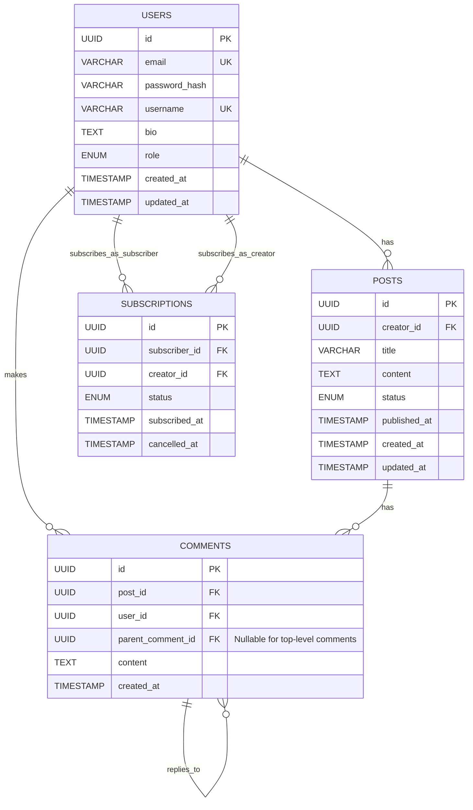

# Database Engineer Agent: Data Modeling and Storage Systems for a Creator Publishing Platform

## Schema Design

The database schema is designed using PostgreSQL, emphasizing normalization for data integrity and flexibility, while considering future scalability. The core entities are Users, Posts, Comments, and Subscriptions.

### Entity-Relationship Diagram (Conceptual Text Description)



## Table Relationships

### 1. `users` Table
*   **`id` (Primary Key):** Unique identifier for each user.
*   **Relationships:**
    *   One-to-Many with `posts`: A user can create many posts (`creator_id` in `posts` references `users.id`).
    *   One-to-Many with `comments`: A user can make many comments (`user_id` in `comments` references `users.id`).
    *   One-to-Many with `subscriptions` (as subscriber): A user can subscribe to many creators (`subscriber_id` in `subscriptions` references `users.id`).
    *   One-to-Many with `subscriptions` (as creator): A user can be subscribed to by many subscribers (`creator_id` in `subscriptions` references `users.id`).

### 2. `posts` Table
*   **`id` (Primary Key):** Unique identifier for each post.
*   **`creator_id` (Foreign Key):** References `users.id`, indicating which user created the post.
*   **Relationships:**
    *   Many-to-One with `users`: Many posts belong to one creator.
    *   One-to-Many with `comments`: A post can have many comments (`post_id` in `comments` references `posts.id`).

### 3. `comments` Table
*   **`id` (Primary Key):** Unique identifier for each comment.
*   **`post_id` (Foreign Key):** References `posts.id`, indicating which post the comment belongs to.
*   **`user_id` (Foreign Key):** References `users.id`, indicating which user made the comment.
*   **`parent_comment_id` (Foreign Key, Nullable):** Self-referencing foreign key to `comments.id`, used for threading comments (replies). If null, it's a top-level comment.
*   **Relationships:**
    *   Many-to-One with `posts`: Many comments belong to one post.
    *   Many-to-One with `users`: Many comments are made by one user.
    *   One-to-Many with `comments` (self-referencing): A comment can have many replies.

### 4. `subscriptions` Table
*   **`id` (Primary Key):** Unique identifier for each subscription record.
*   **`subscriber_id` (Foreign Key):** References `users.id`, indicating the user who is subscribing.
*   **`creator_id` (Foreign Key):** References `users.id`, indicating the creator being subscribed to.
*   **Relationships:**
    *   Many-to-One with `users` (as subscriber): Many subscriptions can be made by one user.
    *   Many-to-One with `users` (as creator): Many subscriptions can be for one creator.

## Indexing Strategy

Indexes are crucial for optimizing query performance, especially as the database grows. They will be applied to frequently queried columns and foreign keys.

*   **Primary Keys:** Automatically indexed by PostgreSQL.
*   **Foreign Keys:** All foreign key columns (`creator_id` in `posts`, `post_id` in `comments`, `user_id` in `comments`, `parent_comment_id` in `comments`, `subscriber_id` in `subscriptions`, `creator_id` in `subscriptions`) will have B-tree indexes to speed up joins and lookups.
*   **Unique Constraints:** Columns with unique constraints (`email`, `username` in `users`) will also be indexed.
*   **Frequently Queried Columns:**
    *   `posts.published_at`: For queries filtering or ordering by publication date.
    *   `comments.created_at`: For ordering comments chronologically.
    *   `subscriptions.status`: For quickly finding active or cancelled subscriptions.
    *   `users.email` and `users.username`: For login and user lookup.

### Example Index Creation (SQL)

```sql
CREATE INDEX idx_posts_creator_id ON posts (creator_id);
CREATE INDEX idx_comments_post_id ON comments (post_id);
CREATE INDEX idx_comments_user_id ON comments (user_id);
CREATE INDEX idx_comments_parent_comment_id ON comments (parent_comment_id);
CREATE INDEX idx_subscriptions_subscriber_id ON subscriptions (subscriber_id);
CREATE INDEX idx_subscriptions_creator_id ON subscriptions (creator_id);
CREATE INDEX idx_posts_published_at ON posts (published_at DESC);
CREATE INDEX idx_subscriptions_status ON subscriptions (status);
```

## Query Optimization Strategy

Optimizing queries is an ongoing process, but several strategies will be employed from the outset.

1.  **`EXPLAIN ANALYZE`:** Regularly use `EXPLAIN ANALYZE` to understand query execution plans, identify bottlenecks, and verify index usage.
2.  **Avoid `SELECT *`:** Explicitly select only the columns needed to reduce data transfer and processing.
3.  **Pagination:** Implement server-side pagination for all list endpoints (e.g., posts, comments, subscriptions) to limit the number of rows returned.
4.  **Batch Operations:** For bulk inserts or updates, use batch operations instead of individual statements to reduce overhead.
5.  **Denormalization (Selective):** While the schema is largely normalized, consider selective denormalization for read-heavy operations where joins are expensive (e.g., caching creator's username on the `posts` table if frequently displayed with posts, but this should be carefully evaluated).
6.  **Materialized Views:** For complex aggregations or reports that don't require real-time data, use materialized views to pre-compute results.
7.  **Connection Pooling:** Use a database connection pool (e.g., PgBouncer) to efficiently manage and reuse database connections, reducing overhead.
8.  **Query Caching:** Implement application-level caching for frequently accessed data that doesn't change often.
9.  **Database Monitoring:** Continuously monitor database performance metrics (CPU, I/O, connections, slow queries) to proactively identify and address issues.

## Migration Strategy

Database migrations will be managed using a tool like **Alembic** (for Python/SQLAlchemy) or **Flyway/Liquibase** (for Java/general SQL). This ensures that schema changes are version-controlled, repeatable, and can be applied consistently across all environments.

### Principles:

*   **Version Control:** Migration scripts will be stored in version control (Git) alongside application code.
*   **Automated Application:** Migrations will be automatically applied as part of the CI/CD pipeline during deployment.
*   **Backward Compatibility:** Strive for backward-compatible schema changes to avoid downtime during deployments. If a breaking change is necessary, a multi-step deployment strategy will be used (e.g., add new column, deploy code that uses both, migrate data, deploy code that uses only new column, remove old column).
*   **Idempotency:** Migration scripts should be idempotent, meaning they can be run multiple times without causing unintended side effects.
*   **Rollback Capability:** Each migration should ideally have a corresponding downgrade script to allow for easy rollback in case of issues.
*   **Data Migrations:** Handle data transformations or migrations within the migration scripts when schema changes require data manipulation.

### Migration Workflow:

1.  **Develop Schema Change:** A developer modifies the ORM models or writes raw SQL for a schema change.
2.  **Generate Migration Script:** The migration tool generates a new script (e.g., `alembic revision --autogenerate -m 
'add user bio'`).
3.  **Review and Test:** The generated script is reviewed by peers and tested in development and staging environments.
4.  **Apply Migration:** During deployment, the CI/CD pipeline executes `alembic upgrade head` (or equivalent) to apply pending migrations to the database.

## Design for Long-Term Scalability

*   **Modular Schema:** The schema is designed with clear separation of concerns, allowing for easier future modifications and potential microservice-specific database splitting.
*   **UUIDs as Primary Keys:** Using UUIDs as primary keys helps in distributed systems by avoiding coordination for ID generation and simplifying sharding strategies in the future.
*   **Foreign Keys and Constraints:** Strict use of foreign keys and database constraints ensures data integrity, which is paramount for long-term data quality.
*   **Indexing Strategy:** A thoughtful indexing strategy is applied to common query patterns, ensuring efficient data retrieval as data volumes grow.
*   **Asynchronous Processing:** Decoupling operations like email notifications via message queues reduces the load on the primary database and allows for independent scaling of different components.
*   **Managed Database Service (AWS RDS):** Leveraging a managed service like RDS provides built-in scalability features (read replicas, automated backups, easy upgrades) and reduces operational overhead, allowing the team to focus on application development.
*   **Sharding Consideration:** While not implemented initially, the schema design and use of UUIDs facilitate future sharding if a single PostgreSQL instance becomes a bottleneck.
*   **Read/Write Separation:** The architecture anticipates separating read and write operations, with read replicas being the first step towards this, allowing read-heavy workloads to scale independently.
*   **Data Archiving:** Plan for data archiving strategies for older, less frequently accessed data to keep the active database lean and performant.
