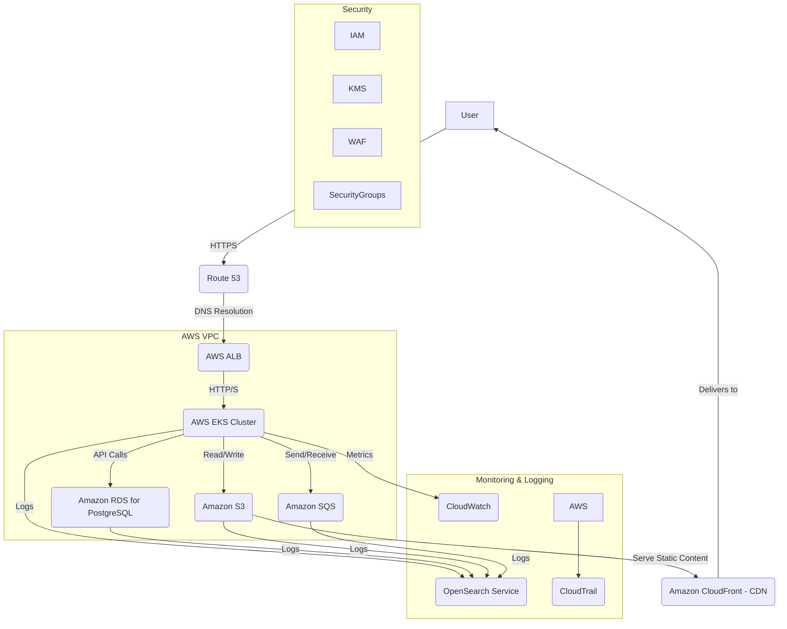

# DevOps / Infrastructure Agent: Infrastructure, Deployment, and Reliability for a Creator Publishing Platform

## Cloud Architecture

The platform will be deployed on **AWS (Amazon Web Services)** due to its comprehensive suite of services, maturity, and extensive documentation. The architecture will be designed for high availability, scalability, and cost-effectiveness.

### Core Components:

*   **Compute:**
    *   **Amazon Elastic Kubernetes Service (EKS):** For orchestrating and managing containerized microservices. This provides automated scaling, self-healing, and efficient resource utilization.
    *   **AWS Fargate:** For serverless compute for specific microservices or background jobs, reducing operational overhead.
*   **Networking:**
    *   **Amazon Virtual Private Cloud (VPC):** Isolated network environment for resources.
    *   **Application Load Balancer (ALB):** Distributes incoming application traffic across multiple targets, ensuring high availability and fault tolerance.
    *   **Route 53:** DNS web service for domain management and traffic routing.
*   **Database:**
    *   **Amazon RDS for PostgreSQL:** Managed relational database service for the core application database, providing automated backups, patching, and scaling.
*   **Storage:**
    *   **Amazon S3:** Object storage for static assets (images, videos, user-uploaded content) and backups.
    *   **Amazon Elastic Block Store (EBS):** Block storage for EC2 instances (if any, primarily for EKS worker nodes).
*   **Messaging:**
    *   **Amazon SQS (Simple Queue Service):** Managed message queuing service for asynchronous task processing (e.g., email notifications, analytics events).
*   **Security:**
    *   **AWS Identity and Access Management (IAM):** Manages access to AWS services and resources.
    *   **AWS Key Management Service (KMS):** For managing encryption keys.
    *   **AWS WAF (Web Application Firewall):** Protects against common web exploits.
    *   **Security Groups & Network ACLs:** Firewall rules for instances and subnets.
*   **Monitoring & Logging:**
    *   **Amazon CloudWatch:** For monitoring resources and applications.
    *   **AWS CloudTrail:** For logging API calls and account activity.
    *   **Amazon OpenSearch Service (formerly Elasticsearch Service):** For centralized log aggregation and analysis.

## Deployment Pipeline Design (CI/CD)

The CI/CD pipeline will be implemented using **GitHub Actions** for automation, integrating with AWS services for deployment.

### Stages:

1.  **Source (GitHub):**
    *   Developers push code to GitHub repositories (e.g., `frontend`, `backend-service-x`, `infrastructure-as-code`).
    *   Triggers the CI/CD pipeline on `push` to `main` or `develop` branches, or on `pull request` creation.

2.  **Build (GitHub Actions):**
    *   **Frontend:** Install dependencies, run linting, unit tests, build static assets (e.g., `npm run build`).
    *   **Backend:** Install dependencies, run linting, unit tests, build Docker images for each microservice.
    *   **Docker Image Push:** Push built Docker images to **Amazon Elastic Container Registry (ECR)**.

3.  **Test (GitHub Actions):**
    *   Run integration tests against a deployed `dev` environment.
    *   Run end-to-end (E2E) tests.
    *   Security scanning (SAST/DAST) on code and images.

4.  **Deploy (GitHub Actions & AWS EKS/Fargate):**
    *   **Infrastructure as Code (IaC):** Use **Terraform** to manage AWS infrastructure. Changes to infrastructure code trigger `terraform plan` and `terraform apply`.
    *   **Kubernetes Deployment:** Update Kubernetes deployment manifests (e.g., `kubectl apply -f deployment.yaml`) to deploy new Docker images to the EKS cluster.
    *   **Rolling Updates:** Implement rolling updates to ensure zero downtime during deployments.
    *   **Rollback:** Automated rollback strategy in case of deployment failures.

### Pipeline Flow:

*   **Development Workflow:** `git push` -> GitHub Actions (Build, Test) -> Deploy to `dev` environment.
*   **Staging Workflow:** `pull request` merge to `develop` -> GitHub Actions (Build, Test) -> Manual approval -> Deploy to `staging` environment.
*   **Production Workflow:** `pull request` merge to `main` -> GitHub Actions (Build, Test) -> Manual approval -> Deploy to `prod` environment.

## Environment Setup

Three distinct environments will be maintained to ensure proper testing and isolation.

### 1. Development (Dev) Environment
*   **Purpose:** For developers to test new features and bug fixes in an isolated setting.
*   **Infrastructure:** Minimal AWS resources, potentially shared EKS cluster or individual developer sandboxes.
*   **Data:** Seeded data, often anonymized or synthetic.
*   **Deployment:** Automated on every successful build from feature branches.
*   **Access:** Restricted to development team.

### 2. Staging Environment
*   **Purpose:** To mimic the production environment as closely as possible for final testing, performance testing, and user acceptance testing (UAT).
*   **Infrastructure:** Scaled-down version of production, but with similar configurations.
*   **Data:** Production-like data (anonymized if sensitive) or recent production backup.
*   **Deployment:** Triggered by merging `develop` into a release branch, requiring manual approval.
*   **Access:** Development, QA, and product teams.

### 3. Production (Prod) Environment
*   **Purpose:** Live environment serving end-users.
*   **Infrastructure:** Fully scaled, highly available, and fault-tolerant AWS resources.
*   **Data:** Live user data.
*   **Deployment:** Triggered by merging a release branch into `main`, requiring strict manual approval and potentially scheduled maintenance windows.
*   **Access:** Highly restricted, only for automated deployments and emergency access by authorized personnel.

## Monitoring and Alerting Setup

Comprehensive monitoring and alerting are critical for maintaining reliability and quickly identifying issues.

### 1. Metrics Collection
*   **Application Metrics:** CPU utilization, memory usage, request latency, error rates, throughput for each microservice (via Prometheus/Grafana or CloudWatch).
*   **Infrastructure Metrics:** EC2 instance health, database performance (IOPS, connections), SQS queue depth, S3 bucket size.
*   **Business Metrics:** Number of new users, posts published, subscriptions (from Analytics Service).

### 2. Logging
*   **Centralized Logging:** All application and infrastructure logs will be aggregated into **Amazon OpenSearch Service** (or a similar solution like Datadog/Splunk).
*   **Structured Logging:** Logs will be in JSON format for easy parsing and querying.
*   **Log Levels:** Implement appropriate log levels (DEBUG, INFO, WARN, ERROR, FATAL).
*   **Traceability:** Include request IDs and correlation IDs in logs to trace requests across services.

### 3. Alerting
*   **CloudWatch Alarms:** Set up alarms on key metrics (e.g., high error rates, low disk space, high CPU utilization).
*   **OpenSearch Alerts:** Create alerts based on log patterns (e.g., specific error messages, security events).
*   **Notification Channels:** Alerts will be sent to PagerDuty for critical issues (on-call rotation), Slack for team awareness, and email for less urgent notifications.
*   **Thresholds:** Define clear thresholds for alerts, balancing sensitivity and avoiding alert fatigue.

### 4. Dashboarding
*   **Grafana/CloudWatch Dashboards:** Create dashboards for real-time visualization of key metrics and logs, providing operational visibility.

## Backup and Recovery Strategy

A robust backup and recovery strategy is essential to ensure data durability and business continuity.

### 1. Database (Amazon RDS for PostgreSQL)
*   **Automated Backups:** Enable automated backups with a retention period (e.g., 30 days). This includes daily full snapshots and transaction logs.
*   **Point-in-Time Recovery (PITR):** RDS allows recovery to any point within the backup retention window.
*   **Manual Snapshots:** Take manual snapshots before major deployments or data migrations.
*   **Cross-Region Replication:** For disaster recovery, replicate the database to a different AWS region.

### 2. Object Storage (Amazon S3)
*   **Versioning:** Enable S3 object versioning to protect against accidental deletions or overwrites.
*   **Replication:** Configure S3 Cross-Region Replication for critical data.
*   **Lifecycle Policies:** Implement lifecycle policies to move older data to cheaper storage classes (e.g., S3 Glacier) or expire it.

### 3. Application Data (EKS/Fargate)
*   **Stateless Services:** Design microservices to be stateless, so application data is primarily in the database or S3. This simplifies recovery as new instances can be launched from images.
*   **Configuration Backups:** Store application configurations and Kubernetes manifests in version control (Git) as the single source of truth.

### 4. Disaster Recovery Plan
*   **Recovery Time Objective (RTO):** Define the maximum acceptable downtime (e.g., 4 hours).
*   **Recovery Point Objective (RPO):** Define the maximum acceptable data loss (e.g., 15 minutes).
*   **Regular Drills:** Conduct regular disaster recovery drills to test the effectiveness of the strategy and identify areas for improvement.
*   **Multi-AZ Deployment:** Deploy critical components across multiple Availability Zones within a region to protect against single AZ failures.

## Optimization for Reliability and Simplicity

*   **Managed Services:** Prioritize AWS managed services (RDS, SQS, EKS, S3) to offload operational burden and leverage AWS's expertise in reliability and scalability.
*   **Infrastructure as Code (IaC):** Use Terraform to define and manage infrastructure, ensuring consistency, repeatability, and reducing human error. This simplifies environment setup and disaster recovery.
*   **Automation:** Automate as much as possible through CI/CD pipelines, reducing manual intervention and increasing deployment frequency and reliability.
*   **Observability:** Implement robust monitoring, logging, and alerting to gain deep insights into system health and quickly respond to issues.
*   **Stateless Design:** Design microservices to be stateless to simplify scaling and recovery. This means any instance can handle any request, and no session data is stored locally.
*   **Clear Boundaries:** Maintain clear service boundaries to limit the blast radius of failures and simplify troubleshooting.
*   **Gradual Scaling:** Start with a simpler architecture and scale components as needed, avoiding premature optimization and unnecessary complexity. For example, starting with RDS and SQS, and only moving to more complex solutions like Kafka or sharded databases when performance demands it.
