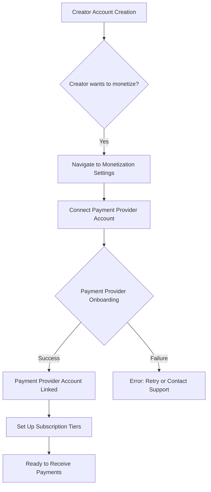
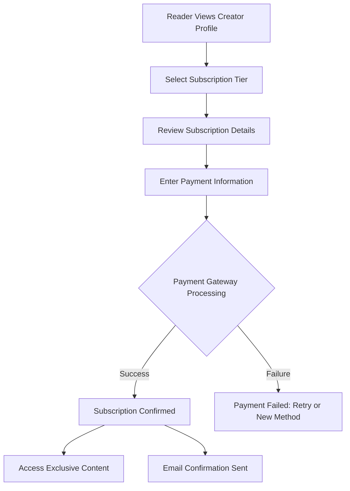
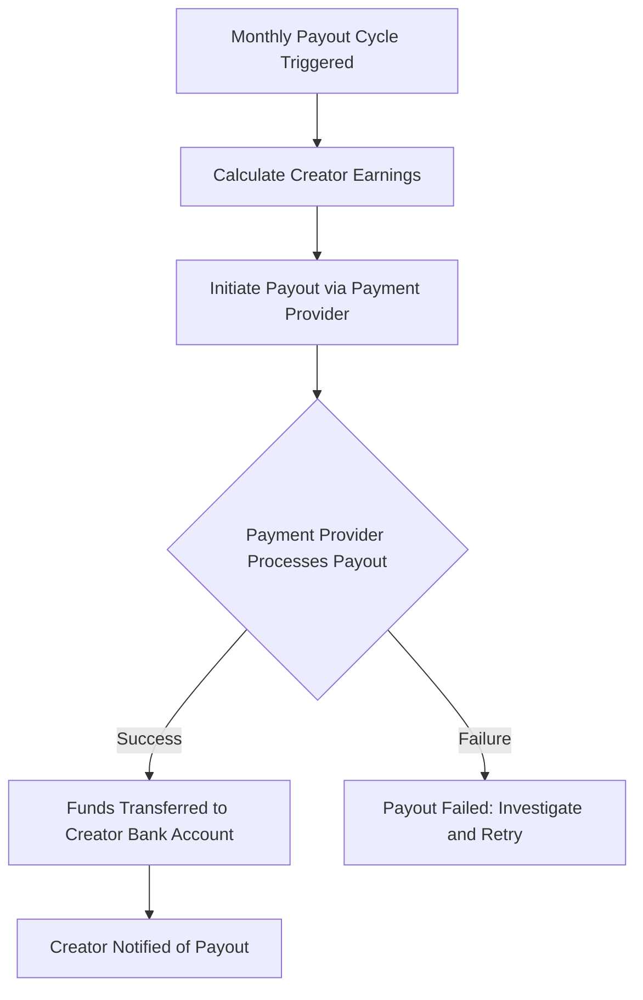

# Payments Engineer Agent: Subscription and Payment Systems for a Creator Publishing Platform

## Payment Flow Design

The payment flow is designed to be secure, user-friendly, and flexible, supporting various payment methods and subscription models. It will primarily involve integration with a third-party payment gateway to handle sensitive financial data and compliance.

### 1. Creator Onboarding for Payments



### 2. Reader Subscription Flow



### 3. Payout to Creators Flow



## Subscription Lifecycle Logic

The platform will manage the full lifecycle of subscriptions, from activation to cancellation and renewal, ensuring accurate billing and access control.

### 1. Activation
*   **Event:** Successful payment for a new subscription.
*   **Action:** Create a `Subscription` record in the database with `status: active`, `subscribed_at`, and `next_renewal_date`.
*   **Access:** Grant reader access to the creator's exclusive content.
*   **Notification:** Send a welcome email to the subscriber.

### 2. Renewal
*   **Event:** `next_renewal_date` is reached.
*   **Action:** Attempt to charge the subscriber's stored payment method via the payment gateway.
    *   **Success:** Update `next_renewal_date`, `status: active`. Send renewal confirmation email.
    *   **Failure:** Mark subscription `status: past_due`. Initiate dunning process (see Failure Handling).

### 3. Cancellation
*   **Event:** Subscriber or creator initiates cancellation, or payment fails after dunning.
*   **Action:** Mark subscription `status: cancelled`, set `cancelled_at` date. Subscription remains active until the end of the current billing period.
*   **Access:** Revoke access to exclusive content at the end of the current billing period.
*   **Notification:** Send cancellation confirmation email.

### 4. Upgrade/Downgrade (Future)
*   **Event:** Subscriber changes subscription tier.
*   **Action:** Prorate existing subscription, apply new tier, adjust `next_renewal_date` and billing amount.

## Payment Integration Architecture

To ensure security and compliance (e.g., PCI DSS), the platform will integrate with a reputable third-party payment gateway (e.g., Stripe, PayPal, Braintree). Direct handling of credit card information will be avoided.

### Key Components:

*   **Payment Gateway SDK/API:** The primary interface for interacting with the payment provider.
*   **Backend Payment Service:** A dedicated microservice responsible for all payment-related operations.
    *   Handles API calls to the payment gateway (e.g., creating customers, charges, subscriptions, payouts).
    *   Stores non-sensitive payment information (e.g., customer IDs from the payment gateway, last 4 digits of card).
    *   Processes webhooks from the payment gateway (e.g., successful payments, failed payments, subscription changes).
*   **Frontend Payment UI:** Uses the payment gateway's client-side SDK (e.g., Stripe Elements) to securely collect payment information without it touching our servers.
*   **Webhook Handler:** An endpoint in the Backend Payment Service to receive and process real-time notifications from the payment gateway.

```mermaid
graph TD
    A[Frontend App] -->|Collects Payment Info (Tokenized)| B(Payment Gateway Client SDK)
    B -->|Securely Sends| C[Payment Gateway]
    A -->|Sends Token/Customer ID| D(Backend Payment Service)
    D -->|API Calls| C
    C -->|Webhooks| D
    D -->|Updates| E[Database (Subscriptions, Earnings)]
    D -->|Triggers| F[Notification Service (Emails)]
    D -->|Initiates| G[Payout Service (to Creators)]
```

## Failure Handling Strategy

Robust failure handling is critical for financial operations to maintain trust and minimize revenue loss.

### 1. Payment Processing Failures (Initial Charge/Renewal)
*   **Immediate Feedback:** Frontend displays an error message to the user, prompting them to retry or use a different payment method.
*   **Backend Logging:** Log detailed error information from the payment gateway for debugging.
*   **Dunning Management:** For recurring payments, implement a dunning process:
    *   **Attempt Retries:** Automatically retry failed charges multiple times over a few days (e.g., 3 retries over 7 days).
    *   **Email Notifications:** Send automated emails to the subscriber about failed payments and instructions to update their payment method.
    *   **Subscription Status:** Temporarily mark subscription as `past_due`. If payment is not updated after dunning, change `status` to `cancelled`.

### 2. Webhook Processing Failures
*   **Idempotency:** Ensure webhook handlers are idempotent to safely process duplicate events.
*   **Retry Mechanism:** Payment gateways typically retry sending webhooks if they don't receive a `200 OK` response. Our webhook handler should return `200 OK` quickly and process the event asynchronously.
*   **Dead-Letter Queue (DLQ):** Failed webhook processing events are moved to a DLQ for manual inspection and reprocessing.

### 3. Payout Failures
*   **Notification:** Alert the finance team and the affected creator about the failed payout.
*   **Investigation:** Manually investigate the reason for failure (e.g., incorrect bank details, bank issues).
*   **Retry:** Once the issue is resolved, manually or automatically retry the payout.

### 4. API Call Failures to Payment Gateway
*   **Retry Logic:** Implement exponential backoff and retry mechanisms for transient network errors or rate limiting from the payment gateway.
*   **Circuit Breaker:** Use a circuit breaker pattern to prevent cascading failures if the payment gateway is experiencing prolonged outages.
*   **Alerting:** Trigger alerts for repeated API call failures to the payment gateway.

## Security and Reliability

### Security Measures:
*   **PCI DSS Compliance:** By integrating with a compliant payment gateway and avoiding direct handling of sensitive card data, the platform minimizes its PCI DSS scope.
*   **Tokenization:** All payment information will be tokenized by the payment gateway. Only tokens (non-sensitive identifiers) will be stored on our servers.
*   **Encryption:** All communication with the payment gateway will use HTTPS/TLS. Data at rest in our database will be encrypted.
*   **Access Control:** Strict IAM policies for accessing payment-related services and data. Least privilege principle applied.
*   **Fraud Detection:** Leverage built-in fraud detection features of the payment gateway. Implement additional fraud checks if necessary.
*   **Audit Logs:** Maintain comprehensive audit logs for all payment-related transactions and system access.

### Reliability Measures:
*   **Redundancy:** Utilize highly available payment gateway services. Design our payment service for high availability (e.g., deployed across multiple availability zones).
*   **Asynchronous Processing:** Use message queues for processing non-critical payment events (e.g., webhook processing, payout initiation) to prevent blocking critical paths.
*   **Monitoring & Alerting:** Monitor payment transaction success rates, webhook processing times, and payout statuses. Set up alerts for anomalies or failures.
*   **Idempotency:** Ensure all payment-related operations are idempotent to prevent duplicate charges or actions in case of retries.
*   **Testing:** Thoroughly test payment flows, including success, failure, and edge cases, in staging environments. Conduct regular penetration testing and security audits.
