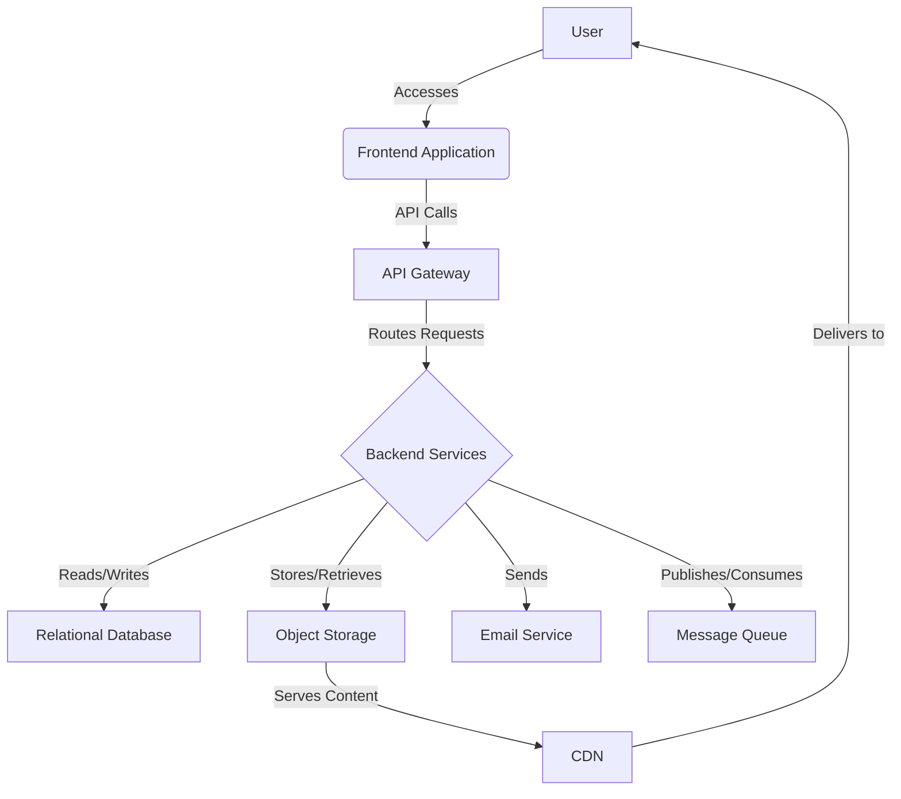

# Technical Architect Agent: Platform Architecture for a Creator Publishing Platform

## High-Level Architecture Diagram (Text Description)

The platform will adopt a **microservices-oriented architecture** to ensure scalability, maintainability, and flexibility. At a high level, the system will consist of several independent services communicating primarily via RESTful APIs and asynchronous messaging. Users will interact with a **Frontend Application** (web-based) which consumes APIs exposed by the **Backend Services**. These services will interact with various **Data Stores** (relational database, object storage) and leverage **Cloud Infrastructure** for deployment, scaling, and operational support. An **Email Service** will handle notifications, and a **CDN** will optimize content delivery.

## Service Breakdown

### 1. User Service
*   **Responsibilities:** User registration, login, authentication (JWT generation/validation), user profile management.
*   **Key Data:** User credentials, profile information.

### 2. Content Service
*   **Responsibilities:** Content creation, editing, publishing, draft management, content retrieval.
*   **Key Data:** Post content, metadata (title, author, publish date, status).

### 3. Comment Service
*   **Responsibilities:** Comment submission, retrieval, moderation (future), creator replies.
*   **Key Data:** Comment text, author, associated post, timestamp.

### 4. Subscription Service
*   **Responsibilities:** Managing reader subscriptions to creators, handling subscription status.
*   **Key Data:** Subscriber-creator relationships.

### 5. Analytics Service
*   **Responsibilities:** Tracking user interactions (page views, comments), aggregating metrics.
*   **Key Data:** Event logs, aggregated statistics.

### 6. Notification Service
*   **Responsibilities:** Sending email notifications for new posts, system alerts.
*   **Key Data:** Email templates, recipient lists.

### 7. API Gateway
*   **Responsibilities:** Central entry point for all client requests, authentication enforcement, request routing, rate limiting (future).

## API Architecture

*   **Style:** RESTful APIs using JSON for request/response payloads.
*   **Authentication:** JWT (JSON Web Tokens) for stateless authentication. Access tokens issued upon successful login, included in `Authorization` header for subsequent requests.
*   **Versioning:** API versioning (e.g., `/api/v1/`) to allow for future changes without breaking existing clients.
*   **Documentation:** OpenAPI/Swagger for API specification and interactive documentation.

## Database Schema Design (Conceptual)

### Users Table
*   `id` (PK, UUID)
*   `email` (Unique, String)
*   `password_hash` (String)
*   `username` (Unique, String)
*   `bio` (Text)
*   `role` (Enum: 'creator', 'reader')
*   `created_at` (Timestamp)
*   `updated_at` (Timestamp)

### Posts Table
*   `id` (PK, UUID)
*   `creator_id` (FK to Users.id)
*   `title` (String)
*   `content` (Text - HTML/Markdown)
*   `status` (Enum: 'draft', 'published')
*   `published_at` (Timestamp, Nullable)
*   `created_at` (Timestamp)
*   `updated_at` (Timestamp)

### Comments Table
*   `id` (PK, UUID)
*   `post_id` (FK to Posts.id)
*   `user_id` (FK to Users.id)
*   `parent_comment_id` (FK to Comments.id, Nullable for top-level comments)
*   `content` (Text)
*   `created_at` (Timestamp)

### Subscriptions Table
*   `id` (PK, UUID)
*   `subscriber_id` (FK to Users.id)
*   `creator_id` (FK to Users.id)
*   `status` (Enum: 'active', 'cancelled')
*   `subscribed_at` (Timestamp)
*   `cancelled_at` (Timestamp, Nullable)

## Technology Stack Recommendations

*   **Backend Framework:** Python with FastAPI or Node.js with Express.js.
    *   **Tradeoff:** Python/FastAPI offers strong typing and performance for APIs, good for data processing. Node.js/Express.js is excellent for I/O-bound tasks and real-time features, leveraging a single language across frontend/backend. For MVP, Python/FastAPI is chosen for its maturity in data-heavy applications and strong ecosystem.
*   **Database:** PostgreSQL.
    *   **Tradeoff:** PostgreSQL is a robust, open-source relational database known for its reliability, extensibility, and strong support for complex queries and data integrity. It scales well vertically and horizontally with proper sharding. MySQL is another strong contender, but PostgreSQL often has a richer feature set.
*   **Object Storage:** AWS S3 or Google Cloud Storage.
    *   **Tradeoff:** Both are highly scalable and reliable for storing static assets like images. AWS S3 is widely adopted and has a vast ecosystem. Google Cloud Storage offers competitive pricing and integrates well with other Google Cloud services.
*   **Message Queue:** RabbitMQ or Apache Kafka.
    *   **Tradeoff:** RabbitMQ is simpler to set up for basic asynchronous tasks like email notifications. Kafka is more suited for high-throughput, fault-tolerant data streaming. For MVP, RabbitMQ is sufficient.
*   **Frontend Framework:** React with TypeScript.
    *   **Tradeoff:** React is a popular, component-based library for building user interfaces, offering a large community and rich ecosystem. TypeScript adds type safety, improving code quality and maintainability. Vue.js and Angular are alternatives, but React's flexibility and community support are strong advantages.
*   **Cloud Provider:** AWS or Google Cloud Platform (GCP).
    *   **Tradeoff:** Both offer comprehensive suites of services. AWS has a larger market share and more mature services. GCP is known for its strong data analytics and AI offerings. For initial deployment, either is suitable, with a preference for AWS due to its extensive documentation and community support.

## Scaling Strategy

### 1. Horizontal Scaling of Backend Services
*   Deploy multiple instances of each microservice behind a load balancer.
*   Use containerization (Docker) and orchestration (Kubernetes) to manage and scale services automatically based on demand.

### 2. Database Scaling
*   **Read Replicas:** For read-heavy workloads, use read replicas to distribute query load.
*   **Sharding:** As data volume grows, implement database sharding to distribute data across multiple database instances.
*   **Connection Pooling:** Optimize database connections to reduce overhead.

### 3. Caching
*   Implement caching at various layers: CDN for static assets, in-memory caches (e.g., Redis) for frequently accessed data (e.g., popular posts, user profiles).

### 4. Asynchronous Processing
*   Offload long-running tasks (e.g., sending email notifications, complex analytics processing) to background workers using message queues.

### 5. Content Delivery Network (CDN)
*   Utilize a CDN to cache and deliver static content (images, CSS, JavaScript) closer to users, reducing latency and backend load.

### 6. Stateless Services
*   Design backend services to be stateless, allowing any instance to handle any request, simplifying horizontal scaling.

## Tradeoffs

*   **Microservices Complexity vs. Scalability:** While microservices offer excellent scalability and flexibility, they introduce operational complexity (e.g., distributed tracing, service discovery, inter-service communication). For an MVP, this complexity is managed by keeping the number of services minimal and focusing on clear boundaries.
*   **Technology Choice (e.g., Python vs. Node.js):** Choosing one over the other involves tradeoffs in ecosystem, performance characteristics, and developer familiarity. Python was chosen for its strong data processing capabilities, which aligns with potential future AI/ML features for content analysis or recommendations.
*   **Database (PostgreSQL):** While highly capable, scaling a relational database can become complex at extreme scales. The strategy includes read replicas and sharding to mitigate this, but it's a known area requiring careful management.
*   **Simplicity vs. Premature Optimization:** The current architecture prioritizes simplicity and widely supported technologies for the MVP, avoiding premature optimization. Features like advanced caching, complex message queues (Kafka), or sophisticated load balancing will be introduced as needed, based on actual usage patterns and performance bottlenecks. This approach ensures faster iteration and reduces initial development overhead.
