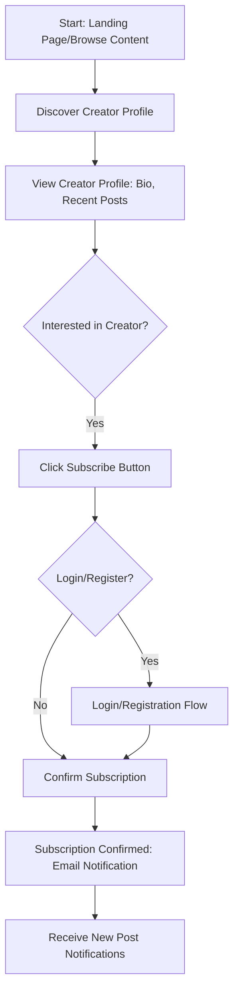

# UX/UI Designer Agent: User Experience and Interfaces for a Creator Publishing Platform

## UX Principles

Our design philosophy is guided by the following core UX principles to ensure a delightful and efficient experience for both creators and readers:

1.  **Clarity & Simplicity:** The interface should be intuitive and easy to understand, minimizing cognitive load. Users should be able to achieve their goals without unnecessary steps or complex jargon.
2.  **Consistency:** Maintain a consistent visual language, interaction patterns, and terminology across the entire platform. This builds familiarity and reduces learning curves.
3.  **Efficiency:** Optimize workflows to allow users to complete tasks quickly and with minimal effort. This includes streamlined content creation, publishing, and consumption processes.
4.  **Feedback & Responsiveness:** Provide immediate and clear feedback for user actions, indicating success, failure, or progress. The interface should be responsive to user input and adapt gracefully to different devices.
5.  **Accessibility:** Design for all users, including those with disabilities. Adhere to WCAG (Web Content Accessibility Guidelines) standards to ensure inclusivity.
6.  **Empowerment:** Provide creators with powerful yet easy-to-use tools that give them control over their content, community, and monetization. Empower readers to easily discover and engage with content.
7.  **Delight:** Incorporate subtle animations, thoughtful micro-interactions, and a clean aesthetic to create an enjoyable and engaging user experience.

## User Flows

### 1. Creator Onboarding & First Post

```mermaid
graph TD
    A[Start: New Creator Registration] --> B{Choose Role: Creator}
    B --> C[Create Profile: Username, Bio]
    C --> D[Dashboard: Empty State]
    D --> E[Click 
New Post Button]
    E --> F[Rich Text Editor: Title, Content]
    F --> G[Add Image (Optional)]
    G --> H[Save Draft]
    H --> I[Publish Post]
    I --> J[Post Live: View Post Page]
    J --> K[Notify Subscribers]
```

### 2. Reader Discovering & Subscribing to a Creator



### 3. Reader Commenting on a Post

```mermaid
graph TD
    A[Start: Viewing Post Page] --> B[Scroll to Comments Section]
    B --> C{Logged In?}
    C -- No --> D[Prompt to Login/Register]
    C -- Yes --> E[Enter Comment Text]
    E --> F[Click Submit Comment]
    F --> G[Comment Appears Below Post]
    G --> H[Creator Receives Notification (Optional)]
```

## Wireframes (Described)

### 1. Landing Page (Public)
*   **Layout:** Hero section with value proposition and call to action (e.g., 
"`Start Writing`" or "`Explore Creators`"). Featured creators/posts below. Footer with links.
*   **Elements:** Navigation bar (Logo, Login/Register, Explore), Hero banner, Creator/Post cards, Call-to-action buttons.

### 2. Creator Dashboard
*   **Layout:** Left sidebar for navigation (Home, New Post, My Posts, Subscribers, Analytics, Settings). Main content area for widgets.
*   **Elements:** Header (Creator Name, Profile Picture, Logout), Navigation links, "New Post" button, Widgets for analytics summary (views, subscribers), Drafts list, Published posts list.

### 3. Rich Text Editor (New Post Page)
*   **Layout:** Clean, minimalist editor interface. Title input field at the top, followed by the main content area.
*   **Elements:** Title input, WYSIWYG toolbar (Bold, Italic, Underline, Headings, Image Embed), Main content editable area, "Save Draft" button, "Publish" button.

### 4. Post Detail Page (Public)
*   **Layout:** Header with creator info (name, profile pic, subscribe button). Main content area for the post. Below the post, a comments section.
*   **Elements:** Creator avatar/name, Post title, Post content, Publish date, "Subscribe" button, Comment input field, List of comments (threaded).

### 5. User Profile Page
*   **Layout:** Header with user's name and profile picture. Bio section. For creators, a list of their published posts.
*   **Elements:** Profile picture, Username, Bio (editable for logged-in user), "Edit Profile" button, List of posts (for creators).

## Component Hierarchy

This outlines a high-level component hierarchy, emphasizing reusability and clear ownership.

*   **`App`**
    *   `Layout` (e.g., `AuthLayout`, `DashboardLayout`, `PublicLayout`)
        *   `Header`
        *   `Sidebar` (for Dashboard)
        *   `MainContent`
            *   **`Auth`**
                *   `LoginForm`
                *   `RegisterForm`
            *   **`Creator`**
                *   `CreatorDashboard`
                    *   `AnalyticsWidget`
                    *   `DraftsList`
                    *   `CreatorPostsList`
                *   `RichTextEditor`
                *   `PublishButton`
            *   **`Post`**
                *   `PostCard` (for lists)
                *   `PostDetail`
                    *   `CreatorInfo`
                    *   `SubscribeButton`
                    *   `PostContent`
                    *   `CommentSection`
                        *   `CommentInput`
                        *   `CommentList`
                            *   `CommentItem`
            *   **`User`**
                *   `UserProfile`
                    *   `ProfileHeader`
                    *   `BioEditor`
                    *   `UserPostsList` (if creator)
            *   **`Shared`**
                *   `Button`
                *   `Input`
                *   `Text`
                *   `Icon`
                *   `Avatar`
                *   `Modal`
                *   `Spinner`

## Interaction Design

### 1. Content Creation & Publishing
*   **Editor:** Real-time preview of formatting. Autosave drafts every few seconds. Clear indication of draft status vs. published status.
*   **Image Upload:** Drag-and-drop functionality for images into the editor, with progress indicator. Images are automatically resized and optimized on upload.
*   **Publishing:** Confirmation modal before publishing. Success message with a link to the live post. Option to share the post immediately.

### 2. Commenting
*   **Submission:** "Post Comment" button becomes active only when text is entered. Loading spinner while comment is being submitted. New comment appears instantly after submission.
*   **Replies:** "Reply" button next to each comment expands an inline comment input field, clearly indicating it's a reply to that specific comment.
*   **Notifications:** Visual indicator (e.g., badge) on the creator dashboard for new comments.

### 3. Subscriptions
*   **Subscribe Button:** Changes state (e.g., from "Subscribe" to "Subscribed") after a successful subscription. Clear feedback on subscription status.
*   **Unsubscribe:** Confirmation modal to prevent accidental unsubscriptions.

### 4. General Interactions
*   **Form Validation:** Real-time inline validation feedback for all form fields (e.g., email format, password strength).
*   **Loading States:** Use skeleton loaders or subtle spinners for content that is still loading, providing a better perceived performance.
*   **Hover States:** Clear hover states for interactive elements (buttons, links, cards) to indicate interactivity.
*   **Empty States:** Thoughtful empty states for lists (e.g., "No posts yet. Start writing your first post!") to guide users.
*   **Responsive Behavior:** Layouts and components adapt fluidly to different screen sizes. Navigation might collapse into a hamburger menu on smaller screens.

## Prioritization of Usability and Clarity

Usability and clarity are paramount and are addressed through:

*   **User-Centered Design Process:** Starting with user flows and wireframes ensures that the design addresses user needs and pain points directly.
*   **Minimalist Aesthetic:** A clean, uncluttered interface reduces visual noise and helps users focus on content and key actions.
*   **Consistent UI Patterns:** Reusing components and interaction patterns across the platform reduces the learning curve and builds user confidence.
*   **Clear Call-to-Actions:** Buttons and links are clearly labeled and visually distinct, guiding users to desired actions.
*   **Error Prevention & Recovery:** Proactive validation, clear error messages, and confirmation steps prevent mistakes and help users recover gracefully.
*   **Accessibility Considerations:** Adhering to WCAG guidelines ensures the platform is usable by a broader audience, enhancing overall usability.
*   **Iterative Design:** Designs will be continuously tested with users and refined based on feedback to ensure optimal usability and clarity.
