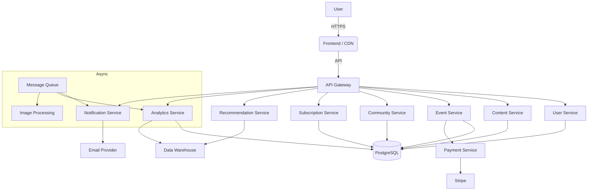

# Platform Architecture

This document consolidates the **Creator Publishing Platform** and **AI-Augmented Event Platform** architecture specs and maps them to the current implementation. It serves as the single source of truth for system design, gaps, and roadmap.

---

## Architecture Overview

The platform combines two product lines:

1. **Creator Publishing** — Posts, comments, subscriptions, content monetization
2. **AI-Augmented Events** — Event creation, RSVPs, ticket sales, recommendations

Both are implemented within a **Next.js monolith** with API routes, using PostgreSQL and Prisma. The microservices-oriented specs describe a target architecture; the current implementation favors simplicity and iteration speed per the “Simplicity vs. Premature Optimization” tradeoff.

### High-Level Architecture (Current)

```
┌─────────────────────────────────────────────────────────────────────────────┐
│                         AI Community Platform                                │
├─────────────────────────────────────────────────────────────────────────────┤
│  Frontend (Next.js / React / TypeScript)                                     │
│  └── App Router, Server Components, Client Components                        │
├─────────────────────────────────────────────────────────────────────────────┤
│  API Layer (Next.js Route Handlers)                                          │
│  └── /api/events, /api/analytics/*, /api/dashboard/*, /api/email/*          │
├─────────────────────────────────────────────────────────────────────────────┤
│  Domain Logic (lib/)                                                         │
│  └── analytics, email, community-auth, admin-auth                            │
├─────────────────────────────────────────────────────────────────────────────┤
│  Data Layer                                                                  │
│  └── Prisma ORM → PostgreSQL (pgvector)                                     │
├─────────────────────────────────────────────────────────────────────────────┤
│  External Services                                                           │
│  └── Resend (email), Stripe (subscriptions, future: tickets), OpenAI        │
└─────────────────────────────────────────────────────────────────────────────┘
```

### Target Architecture (Post-MVP Microservices)



---

## Spec-to-Service Mapping

| Spec Service | Creator Publishing | Event Platform | Current Implementation |
|--------------|--------------------|----------------|------------------------|
| **User Service** | ✓ | ✓ | NextAuth, `User`, `Account`, `Session`, `Profile` |
| **Content Service** | ✓ | — | `Post`, `CreatorPost`, `Article`, `Comment` |
| **Comment Service** | ✓ | — | `Comment`, `CreatorPostComment` |
| **Subscription Service** | ✓ | — | `Subscription`, `SubscriptionTier`, `CreatorSubscription` |
| **Event Service** | — | ✓ | `Event`, `EventRsvp`, `PlatformEvent`, `PlatformEventRsvp` |
| **Community Service** | — | ✓ | `Community`, `Space`, `Member` |
| **Payment Service** | — | ✓ (tickets) | Stripe for subscriptions; **no ticket payments** |
| **Analytics Service** | ✓ | ✓ | `AnalyticsEvent`, `lib/analytics`, aggregation APIs |
| **Notification Service** | ✓ | ✓ | `lib/email`, Resend, `EmailJob` queue |
| **Recommendation Service** | — | ✓ | **Not implemented** |
| **AI Assistant Service** | — | ✓ | `/api/chat` (OpenAI); not a formal service boundary |
| **API Gateway** | ✓ | ✓ | Next.js routes as entry point |

---

## Schema Mapping: Specs → Prisma

### Creator Publishing Spec

| Spec Table | Prisma Model | Notes |
|------------|--------------|-------|
| **Users** | `User` (+ `Account`, `Session`, `Profile`) | `ApiUserRole` (creator/reader); OAuth via NextAuth |
| **Posts** | `Post`, `CreatorPost` | Community posts + standalone creator posts |
| **Comments** | `Comment`, `CreatorPostComment` | Both support threading via `parentId` |
| **Subscriptions** | `Subscription`, `CreatorSubscription` | Community tiers + creator direct |

### Event Platform Spec

| Spec Table | Prisma Model | Notes |
|------------|--------------|-------|
| **Users** | `User` | Same as above |
| **Events** | `Event`, `PlatformEvent` | Community events + standalone platform events |
| **Communities** | `Community` | `ownerId` = creator |
| **RSVPs** | `EventRsvp`, `PlatformEventRsvp` | `going`/`maybe`/`not_going` or `attending`/`interested` |
| **Tickets** | — | **Not implemented** (see [Event Tickets Design](#event-tickets-design-proposal)) |

### NoSQL (Event Spec) — Current Approach

The Event Platform spec suggests MongoDB for:
- **User interactions** (event views, clicks, searches)
- **AI assistant chat history**

**Current:** Both are handled in PostgreSQL:
- Interactions → `AnalyticsEvent` (JSON payload)
- Chat history → not persisted (stateless `/api/chat`)

**Recommendation:** Stay on PostgreSQL unless volume or query patterns justify a separate store. pgvector supports embeddings for recommendations.

---

## Technology Stack

| Component | Spec Recommendation | Current | Notes |
|-----------|----------------------|---------|-------|
| **Frontend** | React + TypeScript | Next.js 16 (React 19, TS) | ✓ Aligned |
| **Backend** | Python/FastAPI or Node/Express | Next.js API routes (Node) | Monolith, not microservices |
| **Database** | PostgreSQL | PostgreSQL + Prisma | ✓ pgvector enabled |
| **NoSQL** | MongoDB | — | Using PostgreSQL for analytics |
| **Cache** | Redis | — | Not yet; add when scaling |
| **Object Storage** | S3/GCS | — | Plan for uploads |
| **Message Queue** | RabbitMQ / SQS | `EmailJob` (DB-backed), Resend | SQS in [INFRASTRUCTURE.md](./INFRASTRUCTURE.md) |
| **Payments** | Payment gateway | Stripe | Subscriptions; tickets TBD |
| **AI/ML** | Python (Flask/FastAPI) | OpenAI API (Node) | Chat; future: embeddings, recommendations |
| **Cloud** | AWS / GCP | Railway (current); AWS target | See [INFRASTRUCTURE.md](./INFRASTRUCTURE.md) |
| **API Versioning** | `/api/v1/` | `/api/...` (no prefix) | Consider adding for new endpoints |

---

## Event Tickets Design (Proposal)

The Event Platform spec requires ticket purchases. Below is a schema extension and flow aligned with the existing Prisma and Stripe setup.

### Schema Additions

```prisma
enum TicketStatus {
  valid
  used
  refunded
  cancelled
}

model Ticket {
  id             String       @id @default(cuid())
  userId         String
  eventId        String       // FK to Event or PlatformEvent
  eventType      String       // "community" | "platform" — polymorphic
  purchasePrice  Decimal      @db.Decimal(10, 2)
  purchaseDate   DateTime     @default(now())
  status         TicketStatus  @default(valid)
  stripePaymentIntentId String? @unique
  createdAt      DateTime     @default(now())
  updatedAt      DateTime     @updatedAt

  user  User @relation(fields: [userId], references: [id], onDelete: Cascade)
  // event relation depends on eventType — consider EventTicket + PlatformEventTicket models

  @@index([userId])
  @@index([eventId, eventType])
  @@index([status])
}
```

### Event Model Extensions

Add to `Event` and `PlatformEvent`:
- `ticketPrice` (Decimal) — already on `PlatformEvent`
- `capacity` (Int)
- `stripePriceId` (String?) — for Stripe Checkout

### Flow

1. **Purchase:** `POST /api/events/[id]/tickets` → create Stripe Checkout session → webhook creates `Ticket` on payment success
2. **Validation:** `GET /api/events/[id]/tickets/validate?ticket_id=xxx` for check-in
3. **Refunds:** Stripe webhook + update `Ticket.status`

### References

- [Technical-Design-Subscriptions-Revenue.md](../Specification/Technical-Design-Subscriptions-Revenue.md) — revenue share patterns
- Stripe: [Checkout Sessions](https://stripe.com/docs/checkout), [Payment Intents](https://stripe.com/docs/payments/payment-intents)

---

## Gaps and Priorities

### High Priority

| Gap | Impact | Recommendation |
|-----|--------|-----------------|
| **Ticket purchases** | Event Platform spec unfulfilled | Add `Ticket` model, Stripe Checkout flow |
| **Stripe integration** | Subscriptions not operational | Implement webhooks, checkout, creator Connect |
| **API versioning** | Breaking changes risk | Introduce `/api/v1/` for new endpoints |
| **Object storage** | No image/asset uploads | Add S3 (or compatible) for community/post images |

### Medium Priority

| Gap | Impact | Recommendation |
|-----|--------|-----------------|
| **Recommendation engine** | No personalization | Use `AnalyticsEvent` + pgvector embeddings for event/content recs |
| **Creator payouts** | Revenue share unimplemented | Add `PaymentTransaction`, `CreatorPayout` per Technical Design |
| **Redis caching** | DB load under scale | Add Redis for sessions, hot content when needed |
| **AI chat persistence** | No conversation history | Optional: store in PostgreSQL; schema TBD |

### Lower Priority

| Gap | Impact | Recommendation |
|-----|--------|-----------------|
| **MongoDB** | Spec suggests for interactions | Skip; PostgreSQL + AnalyticsEvent sufficient |
| **Microservices** | Operational complexity | Defer; extract services only when boundaries clear |
| **Kafka** | High-throughput streaming | SQS sufficient for MVP; Kafka for future analytics pipeline |

---

## Scaling Strategy

Aligned with [INFRASTRUCTURE.md](./INFRASTRUCTURE.md) and both specs:

1. **Horizontal scaling** — Stateless Next.js; scale instances behind load balancer
2. **Database** — Read replicas, connection pooling (PgBouncer/Prisma Accelerate), sharding when needed
3. **Caching** — CDN (CloudFront) for static assets; Redis for hot data when introduced
4. **Async work** — Email queue (EmailJob); extend to SQS for analytics/notifications
5. **Containerization** — Docker + EKS/Fargate in target AWS architecture

---

## Related Documents

| Document | Purpose |
|----------|---------|
| [DATABASE.md](./DATABASE.md) | Schema design, indexing, migrations |
| [ANALYTICS.md](./ANALYTICS.md) | Event tracking, dashboards, pipeline |
| [INFRASTRUCTURE.md](./INFRASTRUCTURE.md) | AWS architecture, CI/CD, monitoring |
| [Implementation-Alignment-Audit.md](../Specification/Implementation-Alignment-Audit.md) | Strategy vs. codebase gaps |
| [Technical-Design-Subscriptions-Revenue.md](../Specification/Technical-Design-Subscriptions-Revenue.md) | Revenue share, payment models |

---

*Last updated: 2025-02-23*
