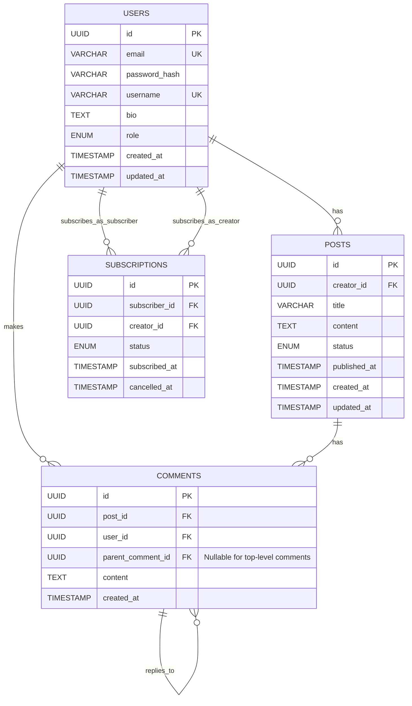

# Database Design Specification

This document defines the data modeling, indexing, query optimization, and migration strategy for the AI Community Platform. The platform uses **PostgreSQL** with **Prisma** as the ORM and migration tool.

---

## Conceptual Schema (Core Entities)

The conceptual model focuses on: **Users**, **Posts**, **Comments**, and **Subscriptions**. The actual implementation extends this with communities, spaces, events, and more (see [Mapping to Current Schema](#mapping-to-current-schema) below).

### Entity-Relationship Diagram

### Table Relationships (Conceptual)

| Table | Relationships |
|-------|---------------|
| **users** | One-to-Many → posts (`creator_id`), comments (`user_id`), subscriptions (as `subscriber_id` and `creator_id`) |
| **posts** | Many-to-One → users (`creator_id`); One-to-Many → comments (`post_id`) |
| **comments** | Many-to-One → posts, users; One-to-Many → comments (self-ref via `parent_comment_id`) |
| **subscriptions** | Many-to-One → users (as subscriber and creator) |

---

## Mapping to Current Schema

The AI Community Platform implements a **community-centric** model. Here is how the conceptual entities map to the Prisma schema:

| Conceptual | Current Implementation |
|------------|------------------------|
| **users** | `User` (+ `Account`, `Session`, `Profile`) |
| **posts** | `Post` (scoped to `Space` and `Community`; `authorId` ≈ `creator_id`) |
| **comments** | `Comment` (with `parentId` for threading) |
| **subscriptions** | `Subscription` (subscribes to **Community** via `SubscriptionTier`, not direct creator) |

**Additional models in current schema:**
- `Community`, `Space`, `Member` – community structure
- `Event`, `EventRsvp` – events
- `Notification` – user notifications
- `SubscriptionTier` – paid tiers per community
- `Activity` – activity feed
- `ContactSubmission`, `EmailJob`, `EmailFeedback`, `EmailUnsubscribe` – contact & email
- `AnalyticsEvent` – product analytics
- `Post.embedding` – pgvector for AI/semantic search

---

## Indexing Strategy

Indexes are critical for query performance. Apply indexes to:
- **Primary keys** – automatically indexed
- **Foreign keys** – for joins and lookups
- **Unique constraints** – indexed by PostgreSQL
- **Frequently queried columns** – e.g. `published_at`, `created_at`, `status`

### Recommended Indexes (Core Entities)

| Table | Column(s) | Purpose |
|-------|-----------|---------|
| Post | `authorId` | Creator posts lookup |
| Post | `communityId` | Community feed |
| Post | `spaceId` | Space-scoped queries |
| Post | `status`, `createdAt` | Published posts, chronological order |
| Comment | `postId` | Comments per post |
| Comment | `authorId` | User comments |
| Comment | `parentId` | Thread replies |
| Subscription | `subscriberId` | User's subscriptions |
| Subscription | `communityId` | Community subscribers |
| Subscription | `status` | Active/cancelled filter |

### Existing Indexes in Schema

The schema already defines indexes for:
- `ContactSubmission`: `createdAt`, `inquiryType`
- `EmailJob`: `(status, scheduledAt)`, `emailType`
- `EmailFeedback`: `email`, `type`, `processed`
- `EmailUnsubscribe`: `email`
- `AnalyticsEvent`: `eventName`, `userId`, `timestamp`, `(eventName, timestamp)`

---

## Query Optimization

1. **`EXPLAIN ANALYZE`** – Use for execution plans and index usage
2. **Avoid `SELECT *`** – Select only needed columns
3. **Pagination** – Use cursor- or offset-based pagination for lists
4. **Batch operations** – Use `createMany`, `updateMany` for bulk work
5. **Selective denormalization** – Consider caching hot data (e.g. creator display name on posts) if joins become costly
6. **Materialized views** – For complex aggregations not needing real-time data
7. **Connection pooling** – Use PgBouncer or Prisma Accelerate in production
8. **Application caching** – Cache frequently accessed, slowly changing data
9. **Monitoring** – Track CPU, I/O, connections, and slow queries

---

## Migration Strategy

Migrations are managed with **Prisma Migrate** (not Alembic/Flyway).

### Principles

- **Version control** – Migrations live in `prisma/migrations/` alongside code
- **Automated application** – `prisma migrate deploy` runs in CI/CD (see [DEPLOYMENT.md](../DEPLOYMENT.md), [docs/INFRASTRUCTURE.md](./INFRASTRUCTURE.md))
- **Backward compatibility** – Prefer additive changes; use multi-step deploys for breaking changes
- **Idempotency** – Migration scripts should be safe to re-run where possible
- **Rollback** – Use `prisma migrate resolve` or manual downgrades when needed
- **Data migrations** – Include data transforms in migrations when schema changes require them

### Workflow

1. **Change schema** – Edit `prisma/schema.prisma`
2. **Create migration** – `npx prisma migrate dev --name add_user_bio`
3. **Review & test** – Run in dev/staging
4. **Deploy** – CI/CD runs `prisma migrate deploy` on deploy

---

## Long-Term Scalability

- **Modular schema** – Clear separation (communities, posts, subscriptions) supports future splitting
- **Stable IDs** – CUIDs (like UUIDs) avoid coordination and support sharding
- **Foreign keys & constraints** – Enforce integrity
- **Indexing** – Align with query patterns
- **Async processing** – Email/analytics via queues reduce DB load
- **Managed DB (RDS)** – Replicas, backups, scaling
- **Sharding** – Schema and IDs support future sharding
- **Read/write separation** – Use read replicas for read-heavy workloads
- **Data archiving** – Plan for archiving old data to keep the active DB lean

---

## Related Documents

- [prisma/schema.prisma](../prisma/schema.prisma) – Current schema definition
- [DEPLOYMENT.md](../DEPLOYMENT.md) – Deployment (includes `prisma migrate deploy`)
- [docs/INFRASTRUCTURE.md](./INFRASTRUCTURE.md) – AWS RDS and backup strategy
