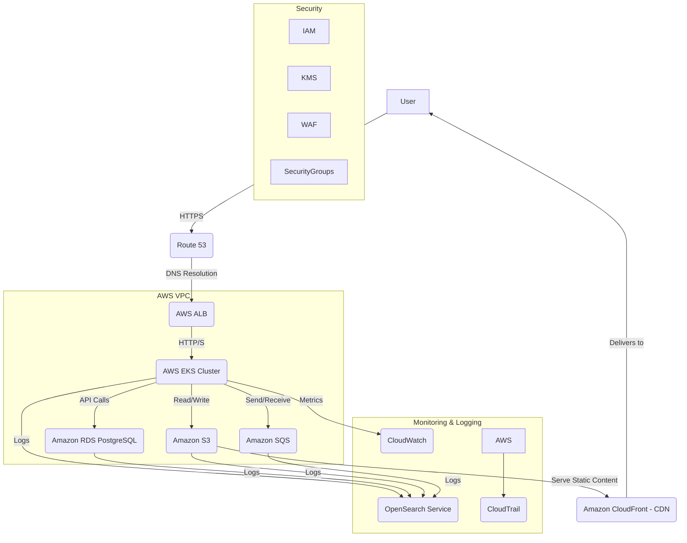

# Infrastructure & DevOps Specification

This document defines the cloud architecture, deployment pipeline, environments, monitoring, and backup strategy for the AI Community Platform. The platform is currently deployed on Railway; this spec describes the target production-grade cloud architecture.

- **MVP (recommended first):** ECS/Fargate monolithic, Redis, SES — simpler and cost-effective.
- **Scale-up:** EKS, microservices, NoSQL, CDN — for higher traffic and complexity.

---

## MVP Architecture (Recommended for Launch)

For the MVP, we use **AWS** with a simple, cost-effective stack designed for reliability and minimal operational overhead. **Note:** The database requires PostgreSQL with **pgvector** extension.

| AWS Service | Purpose | Configuration |
|-------------|---------|----------------|
| **Amazon ECS (Fargate)** | Container orchestration | Run a monolithic Node.js/Next.js app as a Docker container. Fargate is serverless—no servers to provision or manage. |
| **Application Load Balancer (ALB)** | Traffic distribution | Distribute traffic across containers. SSL termination, health checks, auto-scaling. |
| **Amazon RDS for PostgreSQL** | Managed database | Automated backups, patching, scaling. Must enable pgvector extension. |
| **Amazon S3** | Object storage | User-uploaded assets (images, media). Durable, scalable, cost-effective. |
| **Amazon ElastiCache (Redis)** | Cache & job queue | BullMQ for background jobs; cache for expensive DB queries. |
| **Amazon SES** | Email delivery | Newsletters and transactional emails. Scalable, good deliverability. |

### Local Development (MVP)

Use **Docker Compose** to run the app, PostgreSQL, and Redis locally, mirroring the production setup.

---

## Cloud Architecture (Scale-Up)

The platform targets a major cloud provider (AWS, GCP, or Azure) for high availability, fault tolerance, and cost-effectiveness. **Note:** The database requires PostgreSQL with **pgvector** extension.

### Core Components

| Component | AWS | GCP | Azure | Purpose |
|-----------|-----|-----|-------|---------|
| **VPC** | VPC | VPC | VNet | Isolated network environment |
| **Compute** | EKS | GKE | AKS | Kubernetes orchestration; scaling, self-healing |
| **Compute** | Fargate | Cloud Run | Container Apps | Serverless containers |
| **Serverless** | Lambda | Cloud Functions | Azure Functions | Event-driven tasks (image processing, notifications) |
| **Load Balancer** | ALB | GCLB | Azure LB | Distribute traffic, high availability |
| **CDN** | CloudFront | Cloud CDN | Azure CDN | Static assets, reduced latency |
| **DNS** | Route 53 | Cloud DNS | Azure DNS | Domain management, traffic routing |
| **Database** | RDS PostgreSQL | Cloud SQL PostgreSQL | Azure Database for PostgreSQL | Core app data (pgvector required) |
| **NoSQL** | DynamoDB | Firestore | Cosmos DB | User logs, AI chat history, flexible storage |
| **Caching** | ElastiCache Redis | Memorystore Redis | Azure Cache for Redis | Session management, high-speed retrieval |
| **Storage** | S3 | Cloud Storage | Blob Storage | Static assets, user uploads, backups |
| **Messaging** | MSK/SQS | Pub/Sub | Event Hubs | Async microservice comms; Kafka for streaming, SQS for queues |
| **API** | API Gateway | API Gateway | API Management | API exposure, throttling, authentication |
| **Security** | IAM, KMS, WAF | Cloud IAM, Secret Manager | Azure AD, Key Vault | Access control, secrets, firewall |
| **Secrets** | Secrets Manager | Secret Manager | Key Vault | API keys, DB credentials |
| **CI/CD** | CodePipeline, CodeBuild, ECR | Cloud Build, Artifact Registry | Azure DevOps, ACR | Build, test, deploy; container registry |
| **AI/ML** | SageMaker, Comprehend, Rekognition | Vertex AI | Azure ML | Hosting models; managed AI for NLP, vision |

### Architecture Diagram (AWS)

---

## Deployment Pipeline (CI/CD)

Implemented with **GitHub Actions**, **Terraform**, and **Helm** for infrastructure-as-code. Alternatives: Jenkins, GitLab CI/CD, AWS CodePipeline, Cloud Build, Azure DevOps Pipelines.

### CI Stages

1. **Source** – Code pushed to Git (GitHub/GitLab/Bitbucket) triggers the pipeline  
2. **Build** – Compile code, build Docker images for each microservice  
3. **Unit Tests** – Automated unit tests for code quality  
4. **Static Code Analysis** – Identify bugs and security vulnerabilities (SAST)  
5. **Image Scanning** – Scan Docker images for known CVEs  
6. **Artifact Storage** – Push images to container registry (ECR/GCR/ACR)  

### CD Stages

1. **Deploy to Staging** – Deploy latest successful build to staging (CodeDeploy, ArgoCD, or FluxCD)  
2. **Integration Tests** – Run integration, E2E, API, and security tests against staging; performance/load tests  
3. **UAT** – Product owners and QA perform manual validation  
4. **Deploy to Production** – Upon approval, use blue/green or canary releases to minimize downtime; update Kubernetes manifests and apply to EKS  
5. **Monitor & Rollback** – Monitor metrics and logs post-deploy; automated rollback on critical errors or performance degradation  

### Tools

- **CI/CD:** GitHub Actions, CodePipeline, Jenkins, GitLab CI/CD, or cloud-native (Cloud Build, Azure DevOps)  
- **Build:** CodeBuild, Jenkins, or GitHub Actions  
- **Registry:** ECR, GCR, or ACR for container images  
- **Deploy:** CodeDeploy, ArgoCD, FluxCD for GitOps; Helm for Kubernetes applications  

### CI/CD Principles

- **Automation First** – Automate build, test, and deployment  
- **Fast Feedback** – Quick feedback on code quality and issues  
- **Version Control Everything** – Code, IaC, and pipeline definitions in Git  
- **Small, Frequent Releases** – Continuous delivery to reduce risk and accelerate innovation  
- **Security Integration** – Integrate SAST and DAST early in the pipeline  

### Pipeline Flow

| Workflow | Trigger | Target |
|----------|---------|--------|
| **Development** | `git push` to feature branch | Deploy to `dev` |
| **Staging** | Merge PR to `develop` | Build + Test → Manual approval → Deploy to `staging` |
| **Production** | Merge PR to `main` | Build + Test → Manual approval → Deploy to `prod` |

### MVP Pipeline Flow (Simplified)

1. **Commit** – Developer pushes to a feature branch.
2. **Pull Request** – PR opened to merge into `main`.
3. **Build & Test (CI)** – On every PR, GitHub Actions:
   - Builds the Docker image
   - Runs unit and integration tests
   - Runs linting (static analysis)
4. **Merge** – If checks pass, merge into `main`.
5. **Deploy to Staging** – Merge to `main` automatically deploys to staging (mirror of production).
6. **Deploy to Production** – After manual verification on staging, promote the same build to production (manual trigger in GitHub Actions).

---

## Environments

Three distinct environments ensure a smooth development and deployment workflow.

| Environment | Purpose | Configuration |
|-------------|---------|---------------|
| **Development (Local)** | Local dev and testing | **MVP:** Docker Compose (app, PostgreSQL, Redis). **Scale:** Lightweight; local DB or mocked services. |
| **Staging** | Pre-production testing | Full environment identical to production; own database and services. Integration tests, performance tests, UAT. Data anonymization for sensitive data. |
| **Production** | Live end-users | Highly available, scalable, secure; real user data; stricter access controls. |

### Environment Management

- **IaC:** Use Terraform or CloudFormation to define and provision infrastructure for all environments; ensures consistency and repeatability.
- **Configuration:** Use Ansible or Kubernetes ConfigMaps/Secrets for environment-specific configuration.
- **Secrets:** Store API keys, DB credentials, and similar in AWS Secrets Manager or HashiCorp Vault.

---

## Monitoring & Alerting

### Metrics

| Category | Examples |
|----------|----------|
| **Application** | Request rates, error rates, latency, response times per microservice |
| **System** | CPU, memory, disk I/O, network traffic |
| **Database** | Query performance, connection counts, disk usage, replication status |
| **AI/ML** | Model inference latency, accuracy, data drift |
| **Business** | User sign-ups, event creation rates, RSVPs, ticket purchases, subscriptions, AI feature usage |

### Tools

| Function | Options |
|----------|---------|
| **Monitoring** | Prometheus (time-series), Grafana (dashboards), or CloudWatch / Cloud Monitoring / Azure Monitor |
| **Logging** | ELK (Elasticsearch, Logstash, Kibana) or cloud-native (CloudWatch Logs, Cloud Logging, Azure Monitor Logs) |
| **Alerting** | Alertmanager (Prometheus), PagerDuty, Opsgenie, or cloud-native alerting; notify via email, SMS, Slack |
| **Tracing** | Jaeger, OpenTelemetry, or AWS X-Ray for distributed tracing across microservices |

### Alerting Best Practices

- **Threshold-Based Alerts** – Alerts when metrics exceed thresholds (e.g. error rate > 5%, CPU > 80%).
- **Anomaly Detection** – Use AI-powered anomaly detection for unusual patterns in metrics or logs.
- **Runbooks** – Document runbooks for common alerts with diagnosis and resolution steps.

### MVP Monitoring Setup

- **Metrics & Dashboards:** CloudWatch for CPU, memory, DB connections, etc. Dashboards for system health.
- **Logging:** Application logs structured JSON to `stdout`; collected by CloudWatch Logs.
- **Alarms:** CloudWatch Alarms → PagerDuty or Slack for: high CPU/memory, 5xx surge from ALB, high DB connection count, failing health checks.
- **APM:** Integrate **Datadog** or **New Relic** for distributed tracing and API/DB bottleneck identification.

---

## Backup & Recovery

| Component | Strategy |
|-----------|----------|
| **Database** | Automated daily snapshots (7–30 day retention); PITR; periodic logical backups (`pg_dump`) for cross-region restores; manual snapshots before major deploys; cross-region replication for DR |
| **Object Storage** | S3 versioning; cross-region replication for critical data (e.g. user uploads, event images) |
| **Configuration** | Version-control all IaC (Kubernetes manifests, Helm charts, Terraform) in Git |
| **Container Images** | Store images in ECR (or GCR/ACR); registry provides durability |
| **Compute** | Stateless services; new instances launch from images; automate restoration where possible |

### MVP Backup Configuration

- **Database:** RDS automated daily snapshots, 7-day retention. PITR enabled. Copy snapshots to another region for DR.
- **S3:** Enable versioning on user-upload buckets to protect against accidental deletions or overwrites.
- **IaC:** Define all infrastructure in **Terraform**. Store Terraform state in an S3 bucket with versioning enabled for quick, reliable recreation.

### Disaster Recovery

- **RTO:** Maximum acceptable downtime (e.g. 4 hours)
- **RPO:** Maximum acceptable data loss (e.g. 15 minutes)
- **Plan:** Document procedures for recovering from major outages
- **Multi-AZ / Multi-Region:** Deploy critical services across multiple Availability Zones; consider multi-region for regional outages
- **Automated Restoration:** Automate database and application restoration where possible
- **Testing:** Periodically test backup and recovery procedures to validate effectiveness

---

## Design Principles

- **Managed services first** – RDS, ElastiCache, ECS/EKS, S3 to reduce operational load  
- **Infrastructure as Code** – Terraform for consistency and repeatability  
- **Automation** – CI/CD to minimize manual steps  
- **Observability** – Monitoring, logging, alerting built in  
- **Stateless design** – Services scale horizontally; no local session state  
- **Gradual scaling** – MVP: ECS + Redis + SES; scale up to EKS, SQS, NoSQL only when needed  

---

## Related Documents

- [ARCHITECTURE.md](./ARCHITECTURE.md) – Platform architecture and service mapping
- [DATABASE.md](./DATABASE.md) – Database design, indexing, migrations
- [DEPLOYMENT.md](../DEPLOYMENT.md) – Current Railway deployment (quick start)
- [README.md](../README.md) – Project overview and local development
