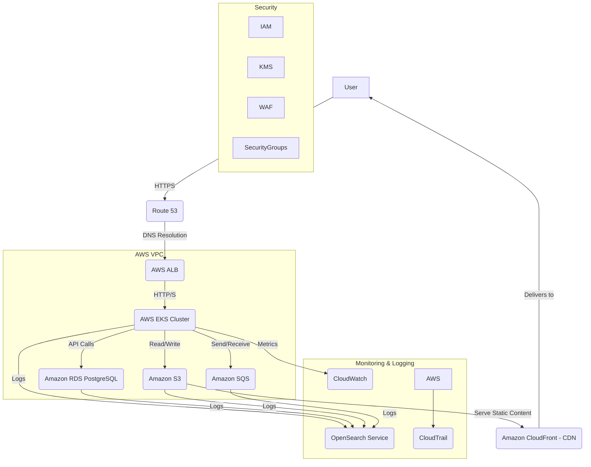

# Infrastructure & DevOps Specification

This document defines the cloud architecture, deployment pipeline, environments, monitoring, and backup strategy for the AI Community Platform when deployed on AWS. The platform is currently deployed on Railway; this spec describes the target production-grade AWS architecture.

---

## Cloud Architecture (AWS)

The platform will be deployed on **Amazon Web Services** for high availability, scalability, and cost-effectiveness. **Note:** The database requires PostgreSQL with **pgvector** extension; RDS must be configured accordingly.

### Core Components

| Component | Service | Purpose |
|-----------|---------|---------|
| **Compute** | Amazon EKS | Orchestrate containerized microservices; automated scaling and self-healing |
| **Compute** | AWS Fargate | Serverless compute for background jobs and specific microservices |
| **Networking** | VPC | Isolated network environment |
| **Networking** | Application Load Balancer (ALB) | Distribute traffic, high availability |
| **Networking** | Route 53 | DNS and traffic routing |
| **Database** | Amazon RDS for PostgreSQL | Core database (must enable pgvector extension) |
| **Storage** | Amazon S3 | Static assets, user uploads, backups |
| **Storage** | EBS | Block storage for EKS worker nodes |
| **Messaging** | Amazon SQS | Asynchronous tasks (emails, analytics events) |
| **Security** | IAM, KMS, WAF | Access control, encryption, web firewall |
| **Monitoring** | CloudWatch, CloudTrail, OpenSearch | Metrics, audit logs, log aggregation |

### Architecture Diagram

---

## Deployment Pipeline (CI/CD)

Implemented with **GitHub Actions** and **Terraform** for infrastructure-as-code.

### Stages

1. **Source** – Push to `main` / `develop` or open pull request → triggers pipeline  
2. **Build** – Frontend: lint, test, build. Backend: lint, test, build Docker images → push to **Amazon ECR**  
3. **Test** – Integration tests (dev env), E2E tests, security scanning (SAST/DAST)  
4. **Deploy** – Terraform for IaC, `kubectl apply` for Kubernetes; rolling updates, automated rollback on failure  

### Pipeline Flow

| Workflow | Trigger | Target |
|----------|---------|--------|
| **Development** | `git push` to feature branch | Deploy to `dev` |
| **Staging** | Merge PR to `develop` | Build + Test → Manual approval → Deploy to `staging` |
| **Production** | Merge PR to `main` | Build + Test → Manual approval → Deploy to `prod` |

---

## Environments

| Environment | Purpose | Deployment | Access |
|-------------|---------|------------|--------|
| **Development** | Feature testing, bug fixes | Auto on successful build | Dev team |
| **Staging** | UAT, performance testing, prod-like | Manual approval after merge to `develop` | Dev, QA, Product |
| **Production** | Live end-users | Manual approval after merge to `main` | Restricted, automated deploys + emergency access |

---

## Monitoring & Alerting

- **Metrics:** Application (CPU, memory, latency, errors), infrastructure (DB, SQS), business (users, posts, subscriptions)
- **Logging:** Centralized in OpenSearch; JSON format; DEBUG/INFO/WARN/ERROR/FATAL; request/correlation IDs
- **Alerts:** CloudWatch alarms (errors, disk, CPU); OpenSearch alerts (patterns); PagerDuty (critical), Slack (awareness), email (non-urgent)
- **Dashboards:** Grafana or CloudWatch dashboards for real-time visibility

---

## Backup & Recovery

| Component | Strategy |
|-----------|----------|
| **RDS PostgreSQL** | Automated backups (e.g. 30 days), PITR, manual snapshots pre-deploy, cross-region replication for DR |
| **S3** | Versioning, cross-region replication, lifecycle policies (e.g. Glacier for older data) |
| **EKS/Fargate** | Stateless services; configs and manifests in Git |

**Disaster Recovery:**
- **RTO:** Maximum acceptable downtime (e.g. 4 hours)
- **RPO:** Maximum acceptable data loss (e.g. 15 minutes)
- Multi-AZ deployment for critical components
- Regular DR drills

---

## Design Principles

- **Managed services first** – RDS, SQS, EKS, S3 to reduce operational load  
- **Infrastructure as Code** – Terraform for consistency and repeatability  
- **Automation** – CI/CD to minimize manual steps  
- **Observability** – Monitoring, logging, alerting built in  
- **Stateless design** – Services scale horizontally; no local session state  
- **Gradual scaling** – Start simple (e.g. RDS + SQS); add complexity (Kafka, sharding) only when needed  

---

## Related Documents

- [DEPLOYMENT.md](../DEPLOYMENT.md) – Current Railway deployment (quick start)
- [README.md](../README.md) – Project overview and local development
