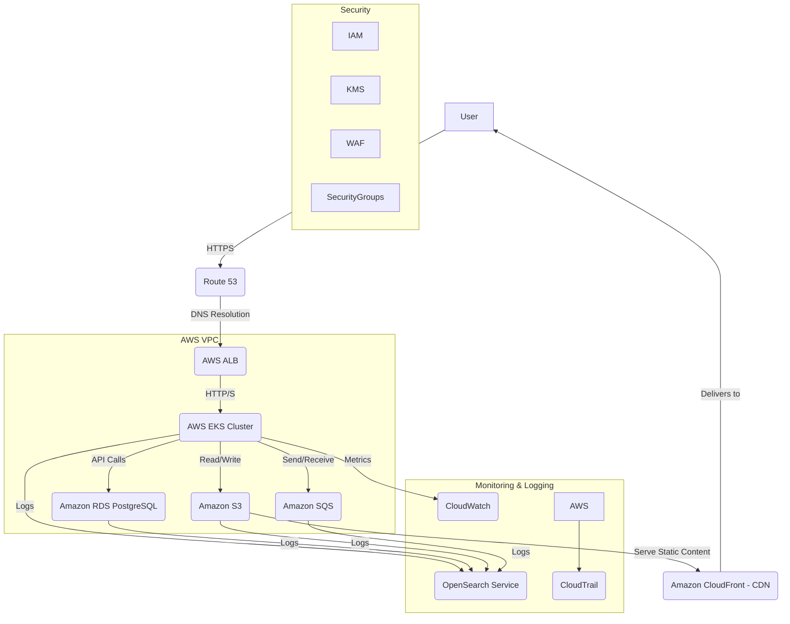

# Infrastructure & DevOps Specification

This document defines the cloud architecture, deployment pipeline, environments, monitoring, and backup strategy for the AI Community Platform. The platform is currently deployed on Railway; this spec describes the target production-grade cloud architecture. The primary reference is **AWS**; alternatives for GCP and Azure are noted where applicable.

---

## Cloud Architecture

The platform targets a major cloud provider (AWS, GCP, or Azure) for high availability, fault tolerance, and cost-effectiveness. **Note:** The database requires PostgreSQL with **pgvector** extension.

### Core Components

| Component | AWS | GCP | Azure | Purpose |
|-----------|-----|-----|-------|---------|
| **VPC** | VPC | VPC | VNet | Isolated network environment |
| **Compute** | EKS | GKE | AKS | Kubernetes orchestration; scaling, self-healing |
| **Compute** | Fargate | Cloud Run | Container Apps | Serverless containers |
| **Serverless** | Lambda | Cloud Functions | Azure Functions | Event-driven tasks (image processing, notifications) |
| **Load Balancer** | ALB | GCLB | Azure LB | Distribute traffic, high availability |
| **CDN** | CloudFront | Cloud CDN | Azure CDN | Static assets, reduced latency |
| **DNS** | Route 53 | Cloud DNS | Azure DNS | Domain management, traffic routing |
| **Database** | RDS PostgreSQL | Cloud SQL PostgreSQL | Azure Database for PostgreSQL | Core app data (pgvector required) |
| **NoSQL** | DynamoDB | Firestore | Cosmos DB | User logs, AI chat history, flexible storage |
| **Caching** | ElastiCache Redis | Memorystore Redis | Azure Cache for Redis | Session management, high-speed retrieval |
| **Storage** | S3 | Cloud Storage | Blob Storage | Static assets, user uploads, backups |
| **Messaging** | SQS | Pub/Sub | Service Bus | Async communication, background tasks |
| **Security** | IAM, KMS, WAF | Cloud IAM, Secret Manager | Azure AD, Key Vault | Access control, secrets, firewall |
| **Secrets** | Secrets Manager | Secret Manager | Key Vault | API keys, DB credentials |

### Architecture Diagram (AWS)

---

## Deployment Pipeline (CI/CD)

Implemented with **GitHub Actions**, **Terraform**, and **Helm** for infrastructure-as-code. Alternatives: Jenkins, GitLab CI/CD, AWS CodePipeline, Cloud Build, Azure DevOps Pipelines.

### CI Stages

1. **Source** – Code pushed to Git (GitHub/GitLab/Bitbucket) triggers the pipeline  
2. **Build** – Compile code, build Docker images for each microservice  
3. **Unit Tests** – Automated unit tests for code quality  
4. **Static Code Analysis** – Identify bugs and security vulnerabilities (SAST)  
5. **Image Scanning** – Scan Docker images for known CVEs  
6. **Artifact Storage** – Push images to container registry (ECR/GCR/ACR)  

### CD Stages

1. **Deploy to Staging** – Deploy latest successful build to staging  
2. **Integration Tests** – Run against deployed staging environment  
3. **UAT** – Product owners and QA perform manual validation  
4. **Deploy to Production** – Upon UAT approval, deploy to prod with rolling updates and automated rollback on failure  

### Tools

- **CI/CD:** GitHub Actions, Jenkins, GitLab CI/CD, or cloud-native (CodePipeline, Cloud Build, Azure DevOps)  
- **Containerization:** Docker  
- **Orchestration:** Kubernetes (EKS/GKE/AKS)  
- **Configuration:** Helm for deploying Kubernetes applications  

### Pipeline Flow

| Workflow | Trigger | Target |
|----------|---------|--------|
| **Development** | `git push` to feature branch | Deploy to `dev` |
| **Staging** | Merge PR to `develop` | Build + Test → Manual approval → Deploy to `staging` |
| **Production** | Merge PR to `main` | Build + Test → Manual approval → Deploy to `prod` |

---

## Environments

Three distinct environments ensure a smooth development and deployment workflow.

| Environment | Purpose | Characteristics | Access |
|-------------|---------|-----------------|--------|
| **Development** | Local dev and testing | Lightweight; local DB or mocked services; rapid iteration | Dev team |
| **Staging** | Integration testing, UAT, performance testing | Mirrors production; realistic data (anonymized if sensitive) | Dev, QA, Product |
| **Production** | Live end-users | Highly available, scalable, secure; real user data | Restricted; automated deploys and emergency access only |

---

## Monitoring & Alerting

### Metrics

| Category | Examples |
|----------|----------|
| **Application** | Request rates, error rates, latency, response times per microservice |
| **System** | CPU, memory, disk I/O, network traffic |
| **Database** | Query performance, connection counts, disk usage, replication status |
| **AI/ML** | Model inference latency, accuracy, data drift |
| **Business** | User sign-ups, event creation rates, RSVPs, ticket purchases, subscriptions |

### Tools

| Function | Options |
|----------|---------|
| **Monitoring** | Prometheus (time-series), Grafana (dashboards), or CloudWatch / Cloud Monitoring / Azure Monitor |
| **Logging** | ELK (Elasticsearch, Logstash, Kibana) or cloud-native (CloudWatch Logs, Cloud Logging, Azure Monitor Logs) |
| **Alerting** | Alertmanager (Prometheus), PagerDuty, Opsgenie, or cloud-native alerting; notify via email, SMS, Slack |
| **Tracing** | Jaeger or OpenTelemetry for distributed tracing across microservices |

---

## Backup & Recovery

| Component | Strategy |
|-----------|----------|
| **Database** | Automated daily backups (7–30 day retention), PITR, manual snapshots before major deploys, cross-region replication for DR |
| **Object Storage** | Versioning, cross-region backup of critical user uploads (e.g. event images) |
| **Configuration** | Version-control all IaC (Kubernetes manifests, Helm charts, Terraform) in Git |
| **Compute** | Stateless services; new instances launch from images; no local persistent state |

### Disaster Recovery

- **RTO:** Maximum acceptable downtime (e.g. 4 hours)
- **RPO:** Maximum acceptable data loss (e.g. 15 minutes)
- **Plan:** Document steps to restore the platform after a major outage or data center failure
- **Testing:** Periodically test backup and recovery procedures to validate effectiveness

---

## Design Principles

- **Managed services first** – RDS, SQS, EKS, S3 to reduce operational load  
- **Infrastructure as Code** – Terraform for consistency and repeatability  
- **Automation** – CI/CD to minimize manual steps  
- **Observability** – Monitoring, logging, alerting built in  
- **Stateless design** – Services scale horizontally; no local session state  
- **Gradual scaling** – Start simple (e.g. RDS + SQS); add complexity (Kafka, sharding) only when needed  

---

## Related Documents

- [ARCHITECTURE.md](./ARCHITECTURE.md) – Platform architecture and service mapping
- [DATABASE.md](./DATABASE.md) – Database design, indexing, migrations
- [DEPLOYMENT.md](../DEPLOYMENT.md) – Current Railway deployment (quick start)
- [README.md](../README.md) – Project overview and local development
